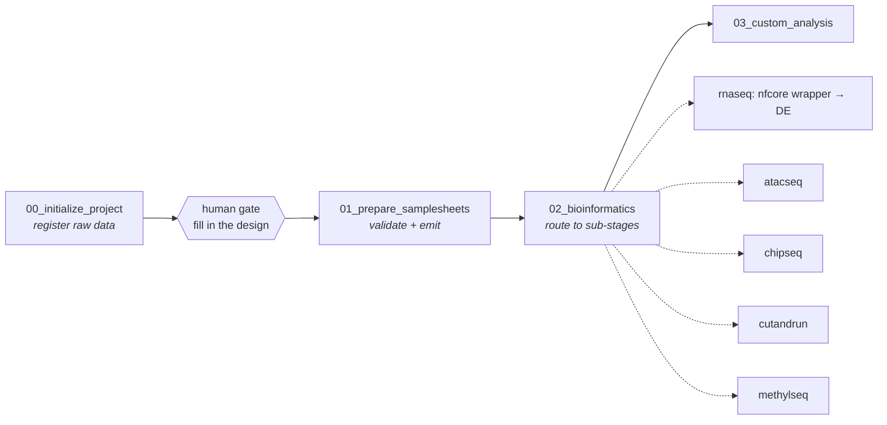

# GARS — Genomics Agentic Research System

A filesystem-native architecture for running reproducible bioinformatics workflows through an
LLM agent, on HPC.

The premise: **the filesystem is the state machine, the LLM is the navigator.** Directory
structure encodes workflow state, each stage is a written contract the agent executes literally,
and scientific decisions stay with the human.

---

## The problem this solves

Handing an LLM agent a bioinformatics pipeline goes wrong in a specific way. Ask it to register
some FASTQs and it will, helpfully, go hunting through neighbouring directories, read a
colleague's old pipeline outputs, infer an experimental design from sample names, and report a
confident summary of work you never asked for.

That behaviour is fine in a chat window and unacceptable in an analysis that ends up in a paper.

GARS constrains it structurally. Every stage declares what it may **not** do, communicates only
through fixed message templates, and stops rather than improvising when inputs are ambiguous.

---

## Getting started

GARS is not installed. You clone it, and **`gars/` inside your clone is your workspace** — you
work there directly.

```bash
git clone https://github.com/javrodriguez/genomics-agentic-research-system.git
cd genomics-agentic-research-system/gars
```

Your projects live in `gars/projects/`, which is gitignored — real data never enters the
repository. Updating is `git pull`; pinning to a release is `git checkout v0.9.0`; seeing what
changed is `git log` and `git diff`.

Then open it with an agent (Claude Code or equivalent) and say what you want:

> *Start a new project called Macrophage Polarization, bulk RNA-seq, data in /path/to/fastqs.*

The agent reads `CLAUDE.md`, routes to the stage that owns your request, and executes that stage's
contract. **You do not run the scripts under `_system/` yourself** — they are the agent's tools.
Your part is the decisions: the project title and assay, confirming the derived sample IDs before
anything is linked, filling in the experimental design, and writing `_config/`. Everything the
system refuses to guess is something it will stop and ask you for.

**Work in the clone; do not copy `gars/` somewhere else.** An earlier design made the workspace a
detached copy, on the theory that freezing the contracts protected reproducibility. It did the
opposite: a copy cannot be diffed, reverted, or pinned, and a fix pushed here never reached it.
A checkout gives you all three for free, and `git pull` is an explicit act, not a silent one.

Clone onto your group work area beside the data, not into `$HOME` — on many HPC clusters those
are different filesystems. Every stage stamps the template version it ran under into the project's
`HISTORY.md`, so `git pull` mid-analysis is recorded rather than invisible.

Stage 02 additionally needs the two conda environments under **Dependencies** below. Stages 00 and
01 need nothing but Python 3.

## Architecture

Context is layered, so an agent loads only what the current task needs:

| Layer | File | Role |
|---|---|---|
| **L0** | `CLAUDE.md` | Orientation. Always loaded. Workspace map and entry rules. |
| **L1** | `CONTEXT.md` | Routing. Stage map, how stages connect, where reference material lives. |
| **L2** | `<stage>/CONTEXT.md` | The stage contract. Loaded per task. |
| **L3** | `_references/`, `_templates/`, `_system/`, a project's `_config/` | Domain knowledge, stamps, runtime and settings. Loaded selectively. |
| **L4** | stage outputs | Working artifacts. |



Each project directory is owned by exactly one stage, and the numeric prefix encodes the owner —
`NN_*` is written by stage `NN_*` and by no other:

```
projects/<title>/
    CONTEXT.md          HISTORY.md          _config/
    00_data/            <- stage 00   raw symlinks, files.csv, samples.csv
    01_samplesheets/    <- stage 01   workflow-ready samplesheet + design table
    02_bioinformatics/  <- stage 02   per-assay sub-stage outputs
    03_custom_analysis/ <- stage 03
```

---

## The stage contract

Every stage contract has the same eight sections. The three that do the real work are
**Scope Boundaries**, **Response Format** and **Human check**.

| Section | Role |
|---|---|
| Purpose | What the stage produces. |
| Inputs | What it collects or reads. |
| **Scope Boundaries** | What it may **not** do. Stated negatively and specifically. |
| Definitions | Every term the process relies on, pinned down so no judgment call is needed. |
| Process | Numbered steps, one action each. Every failure branch is its own step. |
| **Response Format** | The complete set of message templates. Nothing else may be sent. |
| OUTPUT | Artifacts written, with exact contents. |
| **Human check** | The one thing a person does before the next stage runs. Concrete — something they *do*, not "review the output". |

Where a stage's work is deterministic, the Process is not a specification of the computation but
an invocation of it: run the helper in `_system/`, branch on its exit code, render its JSON
through the templates. Stage 01 works this way; stage 02 has always worked this way, delegating
to nf-core pipelines — since v0.7.0 through GARS-authored wrappers versioned in the repo, with
the retired ClawBio skill path deleted after the live switchover validation (decision 0029).

### Why negative constraints

The first version told the agent to "check if the path contains raw data" and, at workspace
level, "do not improvise steps." Given a path with no FASTQs, it searched subdirectories, read a
pipeline's `settings.txt` and sample sheets, and volunteered an analysis of a colleague's
unrelated experiment.

Both instructions were present. Both were ignored. Positive instructions describe a happy path;
they don't forbid anything, and a model's helpfulness prior fills the gap.

What works is naming the forbidden action literally:

> Never search for data. Inspect only the top level of the path the user gives. If it holds no
> raw NGS files, stop and reply with T5. Do not look in subdirectories, do not infer a likely
> alternative location, and do not read sample sheets, settings files, QC reports, or pipeline
> outputs found there.

### Why response templates

Free-form replies varied every run and buried decisions in prose. Each stage now defines
templates `T1…Tn` and may send nothing else — so a validation failure always looks the same, and
"what did the agent actually do" is answerable.

A refusal, then, is a template — here is stage 00's, verbatim from the contract:

> **T5 — Path rejected**
> ```
> Path: <path>
> <error>
>
> Nothing was created or linked.
> ```

---

## The decision log (33 records)

Every design choice in this system is recorded in [docs/decisions/](docs/decisions/CONTEXT.md) —
one file per decision, append-only, each carrying the failure that motivated it and the
alternative it rejected. Reversals are first-class: a decision is never edited to reverse it; a
new one supersedes it by name. The index is greppable by the paths a decision constrains *and*
by the symptoms it explains, so a recurring failure finds its precedent.

Three records that show the method:

- [0002](docs/decisions/0002-agent-control-negative-scope-and-templates.md) — the live test
  where the agent ignored two layers of instruction and analysed a colleague's experiment; why
  every contract now states its boundaries negatively.
- [0016](docs/decisions/0016-workspaces-are-checkouts.md) — 370 lines of freshly built upgrade
  machinery deleted the day they shipped, when the premise under them was re-examined.
- [0029](docs/decisions/0029-the-clawbio-path-is-deprecated.md) — a dependency's published
  fold-changes turned out to correlate 0.33 with its own data; the numerical validation that
  found it, and the migration that removed the dependency from the critical path.

---

## Design decisions worth reading

**The human gate defines the stage boundary.** Stages 00 and 01 are split where a person must
fill in the experimental design — a handoff that can take days. Modelling that as a stage
boundary, rather than a pause inside one stage, makes resumability trivial: state is legible
from the directory tree instead of inferred from file contents.

**Validation splits along that gate.** File-level checks (links resolve, gzip intact, reads
paired) belong to stage 00, where files are touched. Design-level checks (group sizes, contrast
levels, referential integrity) belong to stage 01, because the design does not exist until the
user writes it.

**Two files, two owners.** Sample metadata is split by grain: `files.csv` is machine-owned, one
row per sample-lane; `samples.csv` is user-owned, one row per sample. The user enters each
experimental value exactly once, and "the same sample carries conflicting conditions" becomes
structurally impossible rather than something to validate.

**Subsetting never destroys data.** To analyse fewer samples, delete rows from `samples.csv`.
Stage 01 reports the exclusions and requires confirmation; raw symlinks and `files.csv` are left
untouched, so the choice is reversible. An earlier design made this a hard validation error,
which pushed the agent into deleting 112 symlinks and corrupting a machine-owned file to satisfy
the rule.

**The system refuses to guess science.** No stage defaults `reference`, `de.formula`, or
`de.contrast`. A wrong contrast produces a confident, wrong answer rather than an error, so a
missing value stops the stage and asks.

**The agent orchestrates; code computes.** Anything derived — samplesheets, design tables,
indexes — is produced by a deterministic script, and the contract's job is to run it, hold the
human gates, and report what it returned. The agent handles what prose is good at: mapping a
user's phrasing to an assay, deciding what to do when filenames break convention, asking for
confirmation, explaining a failure. It never transcribes a table. Re-running stage 01 on
unchanged inputs reproduces its output byte for byte.

**A new project is a copy, not a blank page.** Stage 00 instantiates a project by copying
`gars/_templates/project/` and filling its placeholders. The stamp is the schema, so there is one
home for the shape of a project rather than a description restated in each place that needs it.

**Wrappers are orchestrated, not improvised.** Analysis runs through GARS-authored wrappers
versioned in this repository (`gars/_system/wrappers/`), which replaced the external
[ClawBio](https://github.com/ClawBio/ClawBio) skills after four recorded defects (decision
0029). Sub-stage contracts forbid patching wrapper code or substituting a hand-written
analysis — if a tool cannot run, the stage reports the error verbatim and stops.

---

## Worked example

[`examples/demo-project/`](examples/demo-project/) is a synthetic 6-sample project showing the
artifacts each stage produces — `files.csv`, `samples.csv`, the emitted samplesheet and design
table, and both config files. No real data.

---

## Try it without a cluster

The deterministic core runs anywhere — stock Python ≥3.6, stdlib only, no conda:

```bash
python3 tests/run_tests.py         # 38 tests: every helper through its real CLI, in a throwaway workspace
python3 tests/check_contracts.py   # contract lint: sections, wait points, script↔contract vocabulary drift
```

(Tests that need a pinned nf-core checkout skip cleanly as environment failures off-cluster.)
Then read [`examples/demo-project/`](examples/demo-project/) — a synthetic project showing every
artifact each stage produces.

## Status

**Five assays are wired; one is proven live.** All mechanical layers are offline-tested; live
validation is per-assay:

| Assay | State |
|---|---|
| Bulk RNA-seq (`rnaseq_bulk`) | **Live-proven end to end** on real patient-derived data (stage 00 → 01 → nf-core/rnaseq → DE with per-task Slurm dispatch); the wrapper switchover separately validated on a 4-sample two-condition cohort — published fold-changes vs normalized group ratios r = 0.999952 |
| ATAC-seq, ChIP-seq, CUT&RUN, methylation | Wired end to end and offline-tested (contracts, config menus, wrappers against result trees read from each pipeline's own docs); each awaits its first live cluster run |

Stage 03 (custom analysis) is plan-gated and live-validated once: the agent drafts a reviewable
`PLAN.md`, a person approves it, and only the approved plan executes, with the approval and
output verification enforced in code.

Running the system surfaced defects that reading it did not — a samplesheet grain that forced
duplicated hand entry, a contract pointing preflight and execution at the same output directory,
a resume guard keyed on the wrong signal, and pipeline tasks silently dispatched to an
unintended partition. Each is fixed in the contracts, with the reasoning recorded inline so the
next reader does not undo it. Four more were defects in an upstream dependency — two of them
silent — found by numerical validation and reported at
[ClawBio#333](https://github.com/ClawBio/ClawBio/issues/333) and
[ClawBio#365](https://github.com/ClawBio/ClawBio/issues/365).

---

How the system works — the pipeline, the rules that shape it, where everything lives — is in
[docs/architecture.md](docs/architecture.md). Current state and next steps are in
[DEVELOPMENT.md](DEVELOPMENT.md); the reasoning behind each design decision is in
[docs/decisions/](docs/decisions/CONTEXT.md), one file per decision. If you
are working *on* GARS rather than reading about it, start at [CLAUDE.md](CLAUDE.md) — it orients
the repository and links everything else.

## Repository layout

```
DEVELOPMENT.md  status and next steps
gars/           the workspace — clone the repo and work in here
  CLAUDE.md         L0 orientation
  CONTEXT.md        L1 routing: stage map, how stages connect, directory ownership
  00_initialize_project/     01_prepare_samplesheets/
  02_bioinformatics/         03_custom_analysis/
  _references/      assay map, artifact vocabulary, config schema, contract
                    standard, runtime + lockfiles
  _templates/       the stamps stages copy (project/)
  _system/          gars-env.sh — the execution environment; stage00_register.py,
                    stage01_samplesheet.py, resolve_artifact.py; index builder
  projects/         the work, plus a generated _index.md
docs/           architecture, execution model, assay research, decisions/, upstream/
examples/       synthetic worked example
tests/          run_tests.py (38, stdlib-only) + check_contracts.py (contract lint)
```

## Dependencies

Stages 00 and 01 need nothing but Python 3. Stage 02 needs two conda environments:

```bash
conda create -y -n gars-bio python=3.12 pip
conda run -n gars-bio pip install clawbio scikit-learn
conda install -y -n gars-bio -c conda-forge apptainer squashfuse

conda create -y -n gars-nxf -c bioconda -c conda-forge "nextflow=26.04.6" "openjdk>=17,<26"
```

`clawbio` is a historical dependency: the skills it ships are retired from every sub-stage
(decision 0029) and nothing invokes them, but the environment as-built and lockfile-pinned
installs it as the provider of PyDESeq2 and friends — a fresh environment may substitute the
direct dependencies instead. Two environments, because `nextflow` and `clawbio` have
conflicting `c-ares` constraints and cannot be solved together. Exact lockfiles and the traps encountered are in
[`gars/_references/environment.md`](gars/_references/environment.md) — they ship inside the
workspace, so a checkout can rebuild its own runtime without reaching up into the repo.

How the layers relate — package managers, workflow engine, containers, and why a container
holds one tool rather than the pipeline — is in
[`docs/execution-model.md`](docs/execution-model.md).

## Author & status

Built and maintained by [Javier Rodriguez Hernaez](https://github.com/javrodriguez) as a
single-maintainer research system. Issues and questions are welcome; the design is documented
end to end in the decision log, so a "why is it like this?" usually has a written answer.

## License

MIT — see [LICENSE](LICENSE).
