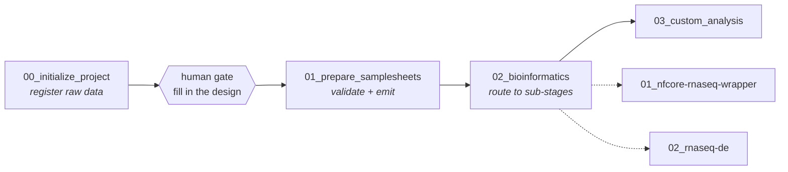

# GARS — Genomics Agentic Research System

A filesystem-native architecture for running reproducible bioinformatics workflows through an
LLM agent, on HPC.

The premise: **the filesystem is the state machine, the LLM is the navigator.** Directory
structure encodes workflow state, each stage is a written contract the agent executes literally,
and scientific decisions stay with the human.

---

## The problem this solves

Handing an LLM agent a bioinformatics pipeline goes wrong in a specific way. Ask it to register
some FASTQs and it will, helpfully, go hunting through neighbouring directories, read a
colleague's old pipeline outputs, infer an experimental design from sample names, and report a
confident summary of work you never asked for.

That behaviour is fine in a chat window and unacceptable in an analysis that ends up in a paper.

GARS constrains it structurally. Every stage declares what it may **not** do, communicates only
through fixed message templates, and stops rather than improvising when inputs are ambiguous.

---

## Architecture

Context is layered, so an agent loads only what the current task needs:

| Layer | File | Role |
|---|---|---|
| **L0** | `CLAUDE.md` | Orientation. Always loaded. Workspace map and entry rules. |
| **L1** | `CONTEXT.md` | Routing. Stage map, how stages connect, where reference material lives. |
| **L2** | `<stage>/CONTEXT.md` | The stage contract. Loaded per task. |
| **L3** | `_config/`, `_references/` | Settings and domain knowledge, loaded selectively. |
| **L4** | stage outputs | Working artifacts. |



Each project directory is owned by exactly one stage, and the numeric prefix encodes the owner —
`NN_*` is written by stage `NN_*` and by no other:

```
projects/<title>/
    CONTEXT.md          HISTORY.md          _config/
    00_data/            <- stage 00   raw symlinks, files.csv, samples.csv
    01_samplesheets/    <- stage 01   workflow-ready samplesheet + design table
    02_bioinformatics/  <- stage 02   per-assay sub-stage outputs
    03_custom_analysis/ <- stage 03
```

---

## The stage contract

Every stage contract has the same seven sections. The two that do the real work are
**Scope Boundaries** and **Response Format**.

| Section | Role |
|---|---|
| Purpose | What the stage produces. |
| Inputs | What it collects or reads. |
| **Scope Boundaries** | What it may **not** do. Stated negatively and specifically. |
| Definitions | Every term the process relies on, pinned down so no judgment call is needed. |
| Process | Numbered steps, one action each. Every failure branch is its own step. |
| **Response Format** | The complete set of message templates. Nothing else may be sent. |
| OUTPUT | Artifacts written, with exact contents. |

### Why negative constraints

The first version told the agent to "check if the path contains raw data" and, at workspace
level, "do not improvise steps." Given a path with no FASTQs, it searched subdirectories, read a
pipeline's `settings.txt` and sample sheets, and volunteered an analysis of a colleague's
unrelated experiment.

Both instructions were present. Both were ignored. Positive instructions describe a happy path;
they don't forbid anything, and a model's helpfulness prior fills the gap.

What works is naming the forbidden action literally:

> Never search for data. Inspect only the top level of the path the user gives. If it holds no
> raw NGS files, stop and reply with T5. Do not look in subdirectories, do not infer a likely
> alternative location, and do not read sample sheets, settings files, QC reports, or pipeline
> outputs found there.

### Why response templates

Free-form replies varied every run and buried decisions in prose. Each stage now defines
templates `T1…Tn` and may send nothing else — so a validation failure always looks the same, and
"what did the agent actually do" is answerable.

---

## Design decisions worth reading

**The human gate defines the stage boundary.** Stages 00 and 01 are split where a person must
fill in the experimental design — a handoff that can take days. Modelling that as a stage
boundary, rather than a pause inside one stage, makes resumability trivial: state is legible
from the directory tree instead of inferred from file contents.

**Validation splits along that gate.** File-level checks (links resolve, gzip intact, reads
paired) belong to stage 00, where files are touched. Design-level checks (group sizes, contrast
levels, referential integrity) belong to stage 01, because the design does not exist until the
user writes it.

**Two files, two owners.** Sample metadata is split by grain: `files.csv` is machine-owned, one
row per sample-lane; `samples.csv` is user-owned, one row per sample. The user enters each
experimental value exactly once, and "the same sample carries conflicting conditions" becomes
structurally impossible rather than something to validate.

**Subsetting never destroys data.** To analyse fewer samples, delete rows from `samples.csv`.
Stage 01 reports the exclusions and requires confirmation; raw symlinks and `files.csv` are left
untouched, so the choice is reversible. An earlier design made this a hard validation error,
which pushed the agent into deleting 112 symlinks and corrupting a machine-owned file to satisfy
the rule.

**The system refuses to guess science.** No stage defaults `reference`, `de.formula`, or
`de.contrast`. A wrong contrast produces a confident, wrong answer rather than an error, so a
missing value stops the stage and asks.

**Skills are orchestrated, not vendored.** Analysis is delegated to external
[ClawBio](https://github.com/ClawBio/ClawBio) skills. Sub-stage contracts forbid patching skill
code or substituting a hand-written analysis — if a tool cannot run, the stage reports the error
verbatim and stops.

---

## Worked example

[`examples/demo-project/`](examples/demo-project/) is a synthetic 6-sample project showing the
artifacts each stage produces — `files.csv`, `samples.csv`, the emitted samplesheet and design
table, and both config files. No real data.

---

## Status

Validated end-to-end on a Slurm HPC cluster against a real 38-sample human RNA-seq dataset:
stage 00 → stage 01 → nf-core/rnaseq preflight → live pipeline execution with per-task Slurm
dispatch.

Stage contracts exist for `00`, `01`, `02` and both `rnaseq_bulk` sub-stages.
`03_custom_analysis` is not yet written.

Running the system surfaced defects that reading it did not — a samplesheet grain that forced
duplicated hand entry, a contract pointing preflight and execution at the same output directory,
a resume guard keyed on the wrong signal, and pipeline tasks silently dispatched to an
unintended partition. Each is fixed in the contracts, with the reasoning recorded inline so the
next reader does not undo it. One was a bug in an upstream dependency, reported at
[ClawBio#333](https://github.com/ClawBio/ClawBio/issues/333).

---

Development history, the reasoning behind each design decision, current state and next steps are
kept in [DEVELOPMENT.md](DEVELOPMENT.md).

## Repository layout

```
DEVELOPMENT.md  running log: status, decisions and their reasoning, next steps
gars/           the workspace template — copy it to start a project
  CLAUDE.md         L0 orientation
  CONTEXT.md        L1 routing, stage map, config schema
  00_initialize_project/     01_prepare_samplesheets/
  02_bioinformatics/         03_custom_analysis/
  _references/      assay -> stage -> sub-stage -> skill map
docs/           execution model, verified cluster runtime, environment lockfiles
examples/       synthetic worked example
```

## Dependencies

Skills are external components, installed rather than vendored:

```bash
conda create -y -n gars-bio python=3.12 pip
conda run -n gars-bio pip install clawbio scikit-learn
conda install -y -n gars-bio -c conda-forge apptainer squashfuse

conda create -y -n gars-nxf -c bioconda -c conda-forge "nextflow=26.04.6" "openjdk>=17,<26"
```

Two environments, because `nextflow` and `clawbio` have conflicting `c-ares` constraints and
cannot be solved together. Exact lockfiles and the traps encountered are in
[`docs/environment.md`](docs/environment.md).

How the layers relate — package managers, workflow engine, containers, and why a container
holds one tool rather than the pipeline — is in
[`docs/execution-model.md`](docs/execution-model.md).

## License

MIT — see [LICENSE](LICENSE).
