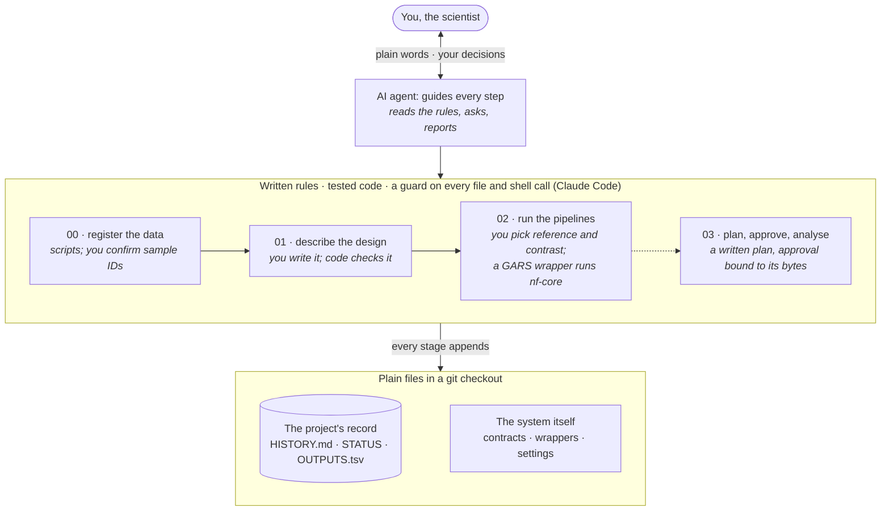
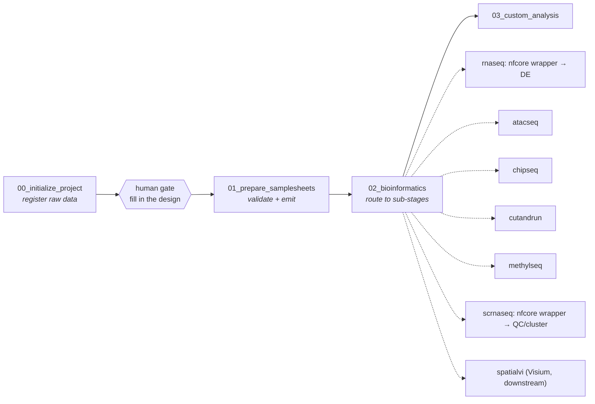

# GARS — Genomics Agentic Research System

[](https://github.com/javrodriguez/genomics-agentic-research-system/actions/workflows/ci.yml)
[](https://github.com/javrodriguez/genomics-agentic-research-system/actions/workflows/fresh-clone.yml)
[](https://github.com/javrodriguez/genomics-agentic-research-system/actions/workflows/geo-recompute.yml)

**Genomics analysis an AI agent can run and a scientist can check.**

GARS lets an AI agent run real genomics pipelines inside a folder of written rules: tested code does the computing, a scientist makes the decisions, and each project keeps an append-only record of every step and the model that took it.

Built by Javier Rodríguez Hernáez, formerly Senior Bioinformatics Programmer at NYU Langone (2018–2026), now open to contract and full-time work in AI for science and genomics · [LinkedIn](https://www.linkedin.com/in/jrodriguezhernaez/) · [GitHub](https://github.com/javrodriguez)

**[▶ Watch a recorded session](https://gars.javrodriguez.dev/demo/)** (set-up on synthetic data) · [Check it yourself](#check-it-yourself) · [A GARS run's reproduction package](reproduction/yeast-atac/) (its re-run result lands with the package) · [Try to break the rules](https://gars.javrodriguez.dev/try/) · [Evidence and limits](https://gars.javrodriguez.dev/evidence/) · [Install](https://gars.javrodriguez.dev/install/) · [Docs](docs/) · [Credits](#credits) · [Cite](CITATION.cff) · MIT

## The agent guides. Tested code computes. You decide.

- **Code computes, not the model.** Pinned nf-core pipelines and GARS's tested scripts do the computing; in a custom analysis, the executor submits the agent's scripts only while the plan's recorded approval holds, and binds them to their bytes at submit. A step completes only when code has checked what came back: a differential-expression table with its gene column missing fails, and the failure is recorded. Under Claude Code, in a session opened in the `gars/` folder, a guard checks every file and shell call the agent makes: the shell runs only GARS's registered tools and read-only commands, writes to the system's own files and machine-owned records are refused, and a call the guard cannot judge is refused. A project not declared public is closed to the guarded agent.
- **You decide, on the record.** GARS never picks your reference or comparison; it offers menus built by code (contrasts from your own design), asks you to confirm exclusions, and stops on a design it can show is confounded. A custom analysis runs from a written plan bound to its exact bytes: the approval is recorded, and editing the plan afterwards voids it. Every stage adds a dated entry to the project's `HISTORY.md`, append-only by written rule and naming the model when the agent reports it; every pipeline-stage output is recorded with its checksum, and a Methods paragraph is rendered from the run's own records, every line naming its source and "not recorded" written instead of a guess.
- **Checked against the real world.** Outputs are scored against the authors' own deposits, and a failed replicate the paper's QC could not see was flagged. A silent fold-change error in an upstream library was found and reported. The agent itself is graded in pre-registered studies, published exactly as graded, misses included, with dated corrections beside the tables.


```mermaid
flowchart TB
    you(["You, the scientist"]) <-->|"plain words · your decisions"| agent["AI agent: guides every step<br/><i>reads the rules, asks, reports</i>"]
    agent --> gov
    subgraph gov["Written rules · tested code · a guard on every file and shell call (Claude Code)"]
        direction LR
        s00["00 · register the data<br/><i>scripts; you confirm sample IDs</i>"] --> s01["01 · describe the design<br/><i>you write it; code checks it</i>"]
        s01 --> s02["02 · run the pipelines<br/><i>you pick reference and contrast;<br/>a GARS wrapper runs nf#8209;core</i>"]
        s02 -.-> s03["03 · plan, approve, analyse<br/><i>a written plan, approval bound to its bytes</i>"]
    end
    gov -->|"every stage appends"| files
    subgraph files["Plain files in a git checkout"]
        direction LR
        rec[("The project's record<br/>HISTORY.md · STATUS · OUTPUTS.tsv")]
        core["The system itself<br/>contracts · wrappers · settings"]
        rec ~~~ core
    end
```

## Check it yourself

1. **Read what the agent may not do**: [the rules folder](https://gars.javrodriguez.dev/system/).
2. **Try to break a rule**: [play the agent](https://gars.javrodriguez.dev/try/); GARS's real guard, at a pinned commit, answers allowed or denied in your browser, with no AI in the verdict.
3. **Watch code refuse a confounded design**: the design check on [the same page](https://gars.javrodriguez.dev/try/).
4. **Watch the agent stop for a person** (opens at the gate): [a recorded agent session](https://gars.javrodriguez.dev/replay/?scenario=03-human-gate&step=5) stops at the exclusion confirmation; code refuses to write the samplesheet until the run carries the confirmation flag.
5. **Follow the failed replicate**: [a failed immunoprecipitation in GSE58638](docs/RESULTS.md#the-finding-a-failed-immunoprecipitation-in-the-published-data) that the paper's depth-only QC could not see; one command re-derives the deposit side from GEO, and [GitHub's runner re-ran it](https://github.com/javrodriguez/genomics-agentic-research-system/actions/runs/36795272678).

**Where it's going.** AI agents can now run a genomics analysis fast; checking their work has not kept up, and GARS is built for the checking. Next, and not claimed until shown: other models on the same rules, with the outputs compared; analysis plans that record their assumptions and what would prove them wrong. A second agent, Codex, runs on the same guard (see [Runs on](#runs-on), [decision 0266](docs/decisions/0266-codex-adapter-one-guard-two-harnesses.md)).

**Where code enforces, and where written rules govern.** Code enforces the completion gates, the design refusals, the guard on file and shell calls, and the byte binding of an approved plan. In stage 03 the agent writes the analysis scripts the approved plan names, and GARS checks the declared outputs exist. Written rules govern the rest: the plan approval, for one, is a rule the agent follows, not yet a lock it cannot reach ([decision 0042](docs/decisions/0042-a-call-the-guard-cannot-judge-is-refused.md)). GARS publishes where its own rules stop: [the Gap Study](docs/EVALS.md) measures how often three Claude models still do the right thing where the rules are silent.

**Scope, plainly.** GARS is a research prototype from one maintainer. Six of its seven assays have run live; methylation awaits its first live run. Three of six reproduction comparisons are scored so far. The scheduler is a setting (Slurm built in, plus a local mode); the published environment for the pipeline stage is Linux-only. See [Runs on](#runs-on) for what each agent gets. Checks and gates reduce risk; they do not make a result scientifically right, and the design and the interpretation stay with you. All the evidence is [below](#the-evidence-in-full).

---

## The problem this solves

Handing an LLM agent a bioinformatics pipeline goes wrong in a specific way. Ask it to register
some FASTQs and it will, helpfully, go hunting through neighbouring directories, read a
colleague's old pipeline outputs, infer an experimental design from sample names, and report a
confident summary of work you never asked for.

That behaviour is fine in a chat window and unacceptable in an analysis that ends up in a paper.

GARS constrains it structurally. Every stage declares what it may **not** do, communicates only
through fixed message templates, and stops rather than improvising when inputs are ambiguous.

---

## The design premise

A filesystem-native architecture for running bioinformatics workflows through an LLM agent, on an HPC cluster (Slurm) or locally.

The premise: **the filesystem is the state machine, the LLM is the navigator.** Directory
structure encodes workflow state, each stage is a written contract the agent executes literally,
and scientific decisions stay with the human. That premise, carried through every layer of the
system, follows the Interpretable Context Methodology (ICM) — Van Clief &amp; McDermott,
[arXiv:2603.16021](https://arxiv.org/abs/2603.16021).

---

## Credits

Two pieces of other people's work shaped GARS's design. (Its analysis also runs on
other projects' tools, among them nf-core pipelines, Nextflow and PyDESeq2; see
[Dependencies](#dependencies).)

**The architecture: Interpretable Context Methodology (ICM).** Jake Van Clief and David McDermott,
*Interpretable Context Methodology: Folder Structure as Agentic Architecture*,
[arXiv:2603.16021](https://arxiv.org/abs/2603.16021) (2026). GARS takes its premise from ICM
and the Model Workspace Protocol it presents, folder structure as agentic architecture, which
GARS states as: the filesystem is the state
machine and the LLM is the navigator. It carries that premise through every layer: numbered
stage folders encode where a run stands, each stage is a written contract the agent executes
literally, context is [layered](#architecture) so an agent loads only what the current task
needs, and mechanical work goes to deterministic scripts, not the model
([decision 0011](docs/decisions/0011-deterministic-artifacts-in-stages-00-01.md)).

**The wrapper layer: [ClawBio](https://github.com/ClawBio/ClawBio).** ClawBio's open
bioinformatics skills were GARS's first analysis layer: at launch GARS delegated its
analysis to them, and its first RNA-seq runs on real data went through ClawBio's nf-core and
differential-expression skills. GARS's own nf-core wrappers in `gars/_system/wrappers/` are
modelled on ClawBio's. They carry over its wrappers' behavioural contract (preflight before
submission, audited parameters, structured failure codes) in a smaller, single-file form
([decision 0028](docs/decisions/0028-wrappers-are-thin-system-helpers.md)), and the
differential-expression wrapper keeps the retired skill's output columns and its low-count
filter ([decision 0029](docs/decisions/0029-the-clawbio-path-is-deprecated.md)). All of GARS's
wrappers are its own code: they replaced ClawBio's skills in both RNA-seq sub-stages, and every
sub-stage now runs on them. Running ClawBio's skills on real data also surfaced defects, which
were reported upstream, and ClawBio fixed them, keeping only a rerun guard the report itself
called defensible: [ClawBio#333](https://github.com/ClawBio/ClawBio/issues/333) ·
[ClawBio#365](https://github.com/ClawBio/ClawBio/issues/365).

To cite either, see the `references` in [CITATION.cff](CITATION.cff).

---

## The evidence in full

**Evidence, if you want it before the design:**

- **▶ [Try the interactive demo](https://gars.javrodriguez.dev/)** — step through recorded agent sessions on real GARS code with small synthetic data and no pipeline execution (the contract-enforced refusal, the playable human gate) in your browser; no install.
- [docs/RESULTS.md](docs/RESULTS.md) — the reproduction campaign scored against what the original
  authors deposited, including a failed immunoprecipitation in published data that the paper's own
  depth-only QC could not have seen.
  - [reproduction/gse58638/](reproduction/gse58638/) — the deposited-track half of that finding,
    recomputed from the authors' own GEO deposit by one standard-library command,
    `python3 reproduction/gse58638/recompute.py` (streams 8.8 GB from NCBI, stores nothing). It
    reproduces the published figures in kind, not exactly, under a pre-registration fixed before
    any deposit byte was read; the per-library half (FRiP, peaks per read) stays quoted.
    GitHub's runner re-ran that command against NCBI and matched the committed report, in
    [GEO recompute run 36795272678](https://github.com/javrodriguez/genomics-agentic-research-system/actions/runs/36795272678) at `dbb434d`.
- [docs/reproduction-campaign.md](docs/reproduction-campaign.md) — the campaign's design: accessions,
  run order, and what gets compared.
- [docs/EVALS.md](docs/EVALS.md) — a separate question: how the **agent** behaved on three
  pre-registered tasks it could fail, each paired with a control, with the thresholds fixed and
  pushed before the first run. The campaign above scores pipeline output; this grades what the
  agent did. Reproducible from a cold clone with `python evals/run.py --all`, and one of the three
  is recorded in advance as expected to fail.
- The Gap Study — [docs/EVALS.md](docs/EVALS.md#the-gap-study)
- The Gap Study, round 2 — [docs/EVALS.md](docs/EVALS.md#the-gap-study-round-2)
- [docs/validity/](docs/validity/README.md) — the question before any Gap Study count: does each
  task measure what it says it measures? One signed validity argument per task, and the graders
  run read-only through the Agentic Benchmark Checklist.
- Defects found in the upstream pipeline tooling, reported and closed:
  [ClawBio#333](https://github.com/ClawBio/ClawBio/issues/333) ·
  [ClawBio#365](https://github.com/ClawBio/ClawBio/issues/365).
- `python3 tests/run_tests.py` and `python3 tests/check_contracts.py` run green from a cold clone
  with no setup, and in CI on every push.
- [PeerPanel](https://github.com/javrodriguez/peerpanel) — a separate demonstration system that
  evaluates its own multi-agent review pipeline against single-agent baselines and publishes the
  result the record shows: on planted defects, no arm asserted one.

---

## Getting started

GARS is not installed. You clone it, and **`gars/` inside your clone is your workspace** — you
work there directly.

```bash
git clone https://github.com/javrodriguez/genomics-agentic-research-system.git
cd genomics-agentic-research-system/gars
```

Your projects live in `gars/projects/`, which is gitignored — real data never enters the
repository. Updating is `git pull`; pinning to a release is `git checkout v0.10.0`; seeing what
changed is `git log` and `git diff`.

Then open it with an agent (Claude Code, Codex, or another that reads `AGENTS.md`) and say what you want:

> *Start a new project called Macrophage Polarization, bulk RNA-seq, data in /path/to/fastqs.*

The agent reads `AGENTS.md` (Codex) or `CLAUDE.md` (Claude Code); both lead to the workspace orientation,
which routes to the stage that owns your request, and the agent executes that stage's contract. **You do not run the scripts under `_system/` yourself** — they are the agent's tools.
Your part is the decisions: the project title and assay, confirming the derived sample IDs before
anything is linked, filling in the experimental design, and writing `_config/`. Everything the
system refuses to guess is something it will stop and ask you for.

### Runs on

| Agent | What you get |
|---|---|
| **Claude Code** | The contracts, the session-start state, and the guard on Read, Glob, Grep, Edit, Write, MultiEdit, NotebookEdit and Bash (`gars/.claude/`). |
| **Codex 0.154 (verified); 0.144 source-checked for the same hook, updatedInput and parser semantics; earlier untested** | The contracts, the session-start state, and the same guard decisions on shell commands and `apply_patch` edits (refused as well where Codex resolves a path through a link differently; decision 0266), once you trust the folder and approve **both** hooks under `/hooks` (`gars/.codex/`); the state render alone proves only the session-start hook, not the guard. Other Codex tools are refused unless [decision 0266](docs/decisions/0266-codex-adapter-one-guard-two-harnesses.md) lists them. (Checked in a live Codex 0.154 session; decision 0266.) Limits include: input typed into a command that is already running is not checked; the shell a command runs under is the model's choice; a command's `environment_id` is not seen by the guard; and login-profile text on the hook's output loses the folder pin (full list: decision 0266). |
| **Another agent that reads `AGENTS.md`** | The contracts, the gitleaks and trailer git hooks, and read-only files only. **No live guard.** |

Start the agent inside `gars/`: a session at the repository root is unguarded ([decision 0042](docs/decisions/0042-a-call-the-guard-cannot-judge-is-refused.md)).

**Work in the clone; do not copy `gars/` somewhere else.** An earlier design made the workspace a
detached copy, on the theory that freezing the contracts protected reproducibility. It did the
opposite: a copy cannot be diffed, reverted, or pinned, and a fix pushed here never reached it.
A checkout gives you all three for free, and `git pull` is an explicit act, not a silent one.

Clone onto your group work area beside the data, not into `$HOME` — on many HPC clusters those
are different filesystems. Every stage stamps the template version it ran under into the project's
`HISTORY.md`, so `git pull` mid-analysis is recorded rather than invisible.

Stage 02 additionally needs the two conda environments under **Dependencies** below. Stages 00 and
01 need nothing but Python 3.

## Architecture

Context is layered, so an agent loads only what the current task needs:

| Layer | File | Role |
|---|---|---|
| **L0** | `AGENTS.md`, `CLAUDE.md` | Orientation. The one your agent loads is always loaded. Workspace map and entry rules. |
| **L1** | `CONTEXT.md` | Routing. Stage map, how stages connect, where reference material lives. |
| **L2** | `<stage>/CONTEXT.md` | The stage contract. Loaded per task. |
| **L3** | `_references/`, `_templates/`, `_system/`, a project's `_config/` | Domain knowledge, stamps, runtime and settings. Loaded selectively. |
| **L4** | stage outputs | Working artifacts. |


```mermaid
flowchart LR
    A["00_initialize_project<br/><i>register raw data</i>"] --> H{{"human gate<br/>fill in the design"}}
    H --> B["01_prepare_samplesheets<br/><i>validate + emit</i>"]
    B --> C["02_bioinformatics<br/><i>route to sub-stages</i>"]
    C --> D["03_custom_analysis"]
    C -.-> C1["rnaseq: nfcore wrapper → DE"]
    C -.-> C2["atacseq"]
    C -.-> C3["chipseq"]
    C -.-> C4["cutandrun"]
    C -.-> C5["methylseq"]
    C -.-> C6["scrnaseq: nfcore wrapper → QC/cluster"]
    C -.-> C7["spatialvi (Visium, downstream)"]
```

Each project directory is owned by exactly one stage, and the numeric prefix encodes the owner —
`NN_*` is written by stage `NN_*` and by no other:

```
projects/<title>/
    CONTEXT.md          HISTORY.md          _config/
    00_data/            <- stage 00   raw symlinks, files.csv, samples.csv
    01_samplesheets/    <- stage 01   workflow-ready samplesheet + design table
    02_bioinformatics/  <- stage 02   per-assay sub-stage outputs
    03_custom_analysis/ <- stage 03
```

---

## The stage contract

Every stage contract has the same eight sections. The three that do the real work are
**Scope Boundaries**, **Response Format** and **Human check**.

| Section | Role |
|---|---|
| Purpose | What the stage produces. |
| Inputs | What it collects or reads. |
| **Scope Boundaries** | What it may **not** do. Stated negatively and specifically. |
| Definitions | Every term the process relies on, pinned down so no judgment call is needed. |
| Process | Numbered steps, one action each. Every failure branch is its own step. |
| **Response Format** | The complete set of message templates. Nothing else may be sent. |
| OUTPUT | Artifacts written, with exact contents. |
| **Human check** | The one thing a person does before the next stage runs. Concrete — something they *do*, not "review the output". |

Where a stage's work is deterministic, the Process is not a specification of the computation but
an invocation of it: run the helper in `_system/`, branch on its exit code, render its JSON
through the templates. Stage 01 works this way; stage 02 has always worked this way, delegating
to nf-core pipelines — since v0.7.0 through GARS-authored wrappers versioned in the repo, with
the retired ClawBio skill path deleted after the live switchover validation (decision 0029).

### Why negative constraints

The first version told the agent to "check if the path contains raw data" and, at workspace
level, "do not improvise steps." Given a path with no FASTQs, it searched subdirectories, read a
pipeline's `settings.txt` and sample sheets, and volunteered an analysis of a colleague's
unrelated experiment.

Both instructions were present. Both were ignored. Positive instructions describe a happy path;
they don't forbid anything, and a model's helpfulness prior fills the gap.

What works is naming the forbidden action literally:

> Never search for data. Inspect only the top level of the path the user gives. If it holds no
> raw NGS files, stop and reply with T5. Do not look in subdirectories, do not infer a likely
> alternative location, and do not read sample sheets, settings files, QC reports, or pipeline
> outputs found there.

### Why response templates

Free-form replies varied every run and buried decisions in prose. Each stage now defines
templates `T1…Tn` and may send nothing else — so a validation failure always looks the same, and
"what did the agent actually do" is answerable.

A refusal, then, is a template — here is stage 00's, verbatim from the contract:

> **T5 — Path rejected**
> ```
> Path: <path>
> <error>
>
> Nothing was created or linked.
> ```

---

## The decision log

Every design choice in this system is recorded in [docs/decisions/](docs/decisions/CONTEXT.md) —
one file per decision, append-only, each carrying the failure that motivated it and the
alternative it rejected. Reversals are first-class: a decision is never edited to reverse it; a
new one supersedes it by name. The index is greppable by the paths a decision constrains *and*
by the symptoms it explains, so a recurring failure finds its precedent.

Three records that show the method:

- [0002](docs/decisions/0002-agent-control-negative-scope-and-templates.md) — the live test
  where the agent ignored two layers of instruction and analysed a colleague's experiment; why
  every contract now states its boundaries negatively.
- [0016](docs/decisions/0016-workspaces-are-checkouts.md) — 370 lines of freshly built upgrade
  machinery deleted the day they shipped, when the premise under them was re-examined.
- [0029](docs/decisions/0029-the-clawbio-path-is-deprecated.md) — a dependency's published
  fold-changes turned out to correlate 0.33 with its own data; the numerical validation that
  found it, and the migration that removed the dependency from the critical path.

---

## Design decisions worth reading

**The human gate defines the stage boundary.** Stages 00 and 01 are split where a person must
fill in the experimental design — a handoff that can take days. Modelling that as a stage
boundary, rather than a pause inside one stage, makes resumability trivial: state is legible
from the directory tree instead of inferred from file contents.

**Validation splits along that gate.** File-level checks (links resolve, gzip intact, reads
paired) belong to stage 00, where files are touched. Design-level checks (group sizes, contrast
levels, referential integrity) belong to stage 01, because the design does not exist until the
user writes it.

**Two files, two owners.** Sample metadata is split by grain: `files.csv` is machine-owned, one
row per sample-lane; `samples.csv` is user-owned, one row per sample. The user enters each
experimental value exactly once, and "the same sample carries conflicting conditions" becomes
structurally impossible rather than something to validate.

**Subsetting never destroys data.** To analyse fewer samples, delete rows from `samples.csv`.
Stage 01 reports the exclusions and requires confirmation; raw symlinks and `files.csv` are left
untouched, so the choice is reversible. An earlier design made this a hard validation error,
which pushed the agent into deleting 112 symlinks and corrupting a machine-owned file to satisfy
the rule.

**The system refuses to guess science.** No stage defaults `reference`, `de.formula`, or
`de.contrast`. A wrong contrast produces a confident, wrong answer rather than an error, so a
missing value stops the stage and asks.

**The agent orchestrates; code computes.** Anything derived — samplesheets, design tables,
indexes — is produced by a deterministic script, and the contract's job is to run it, hold the
human gates, and report what it returned. The agent handles what prose is good at: mapping a
user's phrasing to an assay, deciding what to do when filenames break convention, asking for
confirmation, explaining a failure. It never transcribes a table. Re-running stage 01 on
unchanged inputs reproduces its output byte for byte.

**A new project is a copy, not a blank page.** Stage 00 instantiates a project by copying
`gars/_templates/project/` and filling its placeholders. The stamp is the schema, so there is one
home for the shape of a project rather than a description restated in each place that needs it.

**Wrappers are orchestrated, not improvised.** Analysis runs through GARS-authored wrappers
versioned in this repository (`gars/_system/wrappers/`), which replaced the external
[ClawBio](https://github.com/ClawBio/ClawBio) skills after four recorded defects (decision
0029). Sub-stage contracts forbid patching wrapper code or substituting a hand-written
analysis — if a tool cannot run, the stage reports the error verbatim and stops.

---

## Worked example

[`examples/demo-project/`](examples/demo-project/) is a synthetic 6-sample project showing the
artifacts each stage produces — `files.csv`, `samples.csv`, the emitted samplesheet and design
table, and both config files. No real data.

---

## Try it without a cluster

The deterministic core runs anywhere — stock Python ≥3.6, stdlib only, no conda:

```bash
python3 tests/run_tests.py         # every helper through its real CLI, in a throwaway workspace
python3 tests/check_contracts.py   # contract lint: sections, wait points, script↔contract vocabulary drift
```

(Tests that need a pinned nf-core checkout skip cleanly as environment failures off-cluster.)
The backup tests also skip until you name a scratch folder outside the repository, because they
never write to the system temp folder. To run them too, as CI does:

```bash
mkdir -p ../gars-scratch
GARS_ROW5_SCRATCH="$PWD/../gars-scratch" TMPDIR="$PWD/../gars-scratch" python3 tests/run_tests.py
```

A skip is not a failure. Without the scratch folder a cold clone skips more: a macOS cold clone without it skips 76 (last measured on a smaller suite), or 124 with `TMPDIR` also unset as on Linux; the [Fresh clone](https://github.com/javrodriguez/genomics-agentic-research-system/actions/workflows/fresh-clone.yml) workflow fails any push whose plain Linux run skips more than that.

Then read [`examples/demo-project/`](examples/demo-project/) — a synthetic project showing every
artifact each stage produces.

## Status

- **1303 tests** in `tests/run_tests.py`; CI was green on main at `5c142aa` ([run 37059655674](https://github.com/javrodriguez/genomics-agentic-research-system/actions/runs/37059655674)), with the Gap Study token correction in.
- **Seven assays are wired; most are proven live** — the table below.
- **Build log:** the row-by-row status and its dated evidence are in
  [DEVELOPMENT.md](DEVELOPMENT.md#status-moved-from-the-readme-30-sep-2026); the definition-of-done
  evidence is the generated [docs/implementation/dod_current.md](docs/implementation/dod_current.md),
  where no clause yet carries the external seal a public claim requires.

Live validation is per-assay. Agent behaviour is
graded separately and published in [docs/EVALS.md](docs/EVALS.md), against a pre-registration
frozen before the first run:

| Assay | State |
|---|---|
| Bulk RNA-seq (`rnaseq_bulk`) | **Live-proven end to end** on real patient-derived data (stage 00 → 01 → nf-core/rnaseq → DE with per-task Slurm dispatch); the wrapper switchover separately validated on a 4-sample two-condition cohort — published fold-changes vs normalized group ratios r = 0.999952 |
| ATAC-seq, ChIP-seq, CUT&Tag | **Live-proven** in the reproduction campaign (nf-core pipelines complete on real GEO cohorts under Slurm; results in [docs/RESULTS.md](docs/RESULTS.md)) |
| Single-cell RNA-seq (`scrnaseq`) | **Live-proven in two venues** — nf-core/scrnaseq 4.2.0 + the scanpy QC/clustering sub-stage ran to green exit gates on macOS/Docker and on Slurm/Apptainer, with identical downstream numbers (same cells, same 198 clusters) on both. **The Docker venue is a record of that run, not a road this README can walk you down:** the Dependencies block below installs `apptainer` and `squashfuse`, which conda-forge ships for Linux only, and no Docker environment recipe is published here. |
| Spatial transcriptomics (`spatialvi`, Visium, downstream mode) | **Live-proven on the cluster** — full run + all three artifact gates including MultiQC (a commit pin, stated as such: the pipeline has no current release) |
| Methylation (`methylseq`) | Wired end to end and offline-tested; awaits its first live run (the campaign's WGBS fetch is pending a clean re-download) |

New assays are added through a documented, linted method — `gars/_system/authoring/` scaffolds a
wrapper from a small spec and `conform` checks it against the standard the earlier wrappers
already satisfy; every rule is mutation-tested.

Stage 03 (custom analysis) is plan-gated and live-validated once: the agent drafts a reviewable
`PLAN.md`, a person approves it, and only the approved plan executes, with the approval and
output verification enforced in code.

Running the system surfaced defects that reading it did not — a samplesheet grain that forced
duplicated hand entry, a contract pointing preflight and execution at the same output directory,
a resume guard keyed on the wrong signal, and pipeline tasks silently dispatched to an
unintended partition. Each is fixed in the contracts, with the reasoning recorded inline so the
next reader does not undo it. Four more were defects in an upstream dependency — two of them
silent — found by numerical validation and reported at
[ClawBio#333](https://github.com/ClawBio/ClawBio/issues/333) and
[ClawBio#365](https://github.com/ClawBio/ClawBio/issues/365).

<details>
<summary>The public evidence table: seven fixed rows, all <code>unmeasured</code> so far</summary>

| Metric | Number | Test path | Date |
|---|---|---|---|
| Design-defect catch rate | unmeasured | tests/test_planted_defects.py | unmeasured |
| Reviewer catch rate (code, science) | unmeasured | none | unmeasured |
| Manifest completeness and re-run diff | unmeasured | none | unmeasured |
| Orphan claims | unmeasured | `gars/tests/test_claim_constraints.py` | unmeasured |
| Policy bypass rate | unmeasured | none | unmeasured |
| Restore-drill minutes and age | unmeasured | none | unmeasured |
| Hours per verified capability | unmeasured | none | unmeasured |

</details>

---

How the system works — the pipeline, the rules that shape it, where everything lives — is in
[docs/architecture.md](docs/architecture.md). Current state and next steps are in
[DEVELOPMENT.md](DEVELOPMENT.md); the reasoning behind each design decision is in
[docs/decisions/](docs/decisions/CONTEXT.md), one file per decision. If you
are working *on* GARS rather than reading about it, start at [CLAUDE.md](CLAUDE.md) — it orients
the repository and links everything else.

## Repository layout

```
DEVELOPMENT.md  status and next steps
gars/           the workspace — clone the repo and work in here
  CLAUDE.md         L0 orientation
  CONTEXT.md        L1 routing: stage map, how stages connect, directory ownership
  00_initialize_project/     01_prepare_samplesheets/
  02_bioinformatics/         03_custom_analysis/
  _references/      assay map, artifact vocabulary, config schema, contract
                    standard, runtime + lockfiles
  _templates/       the stamps stages copy (project/)
  _system/          gars-env.sh — the execution environment; stage00_register.py,
                    stage01_samplesheet.py, resolve_artifact.py; index builder
  projects/         the work, plus a generated _index.md
docs/           architecture, execution model, assay research, RESULTS.md,
                reproduction-campaign.md, decisions/, upstream/
examples/       synthetic worked example
tests/          run_tests.py (stdlib-only) + check_contracts.py (contract lint)
```

## Dependencies

Stages 00 and 01 need nothing but Python 3. Stage 02 needs two conda environments:

```bash
conda create -y -n gars-bio python=3.12 pip
conda run -n gars-bio pip install clawbio scikit-learn
conda install -y -n gars-bio -c conda-forge apptainer squashfuse

conda create -y -n gars-nxf -c bioconda -c conda-forge "nextflow=26.04.6" "openjdk>=17,<26"
```

**This block is Linux-only, and it is the only stage-02 environment published here.** `apptainer`
and `squashfuse` are shipped by conda-forge for Linux alone, so the block cannot complete on macOS.
The assay table above records a macOS/Docker run for single-cell RNA-seq; that environment is not
published, so a reader on macOS cannot reach stage 02 by following this page. Said plainly rather
than left to be discovered partway through an install.

`clawbio` is a historical dependency: the skills it ships are retired from every sub-stage
(decision 0029) and nothing invokes them, but the environment as-built and lockfile-pinned
installs it as the provider of PyDESeq2 and friends — a fresh environment may substitute the
direct dependencies instead. Two environments, because `nextflow` and `clawbio` have
conflicting `c-ares` constraints and cannot be solved together. Exact lockfiles and the traps encountered are in
[`gars/_references/environment.md`](gars/_references/environment.md) — they ship inside the
workspace, so a checkout can rebuild its own runtime without reaching up into the repo.

How the layers relate — package managers, workflow engine, containers, and why a container
holds one tool rather than the pipeline — is in
[`docs/execution-model.md`](docs/execution-model.md).

## Related work

**[HiC-MCP](https://github.com/javrodriguez/hic-mcp)** — the same "give an agent real scientific
tools, and make it say what it did" idea at a smaller scale: an MCP server exposing the open2c
Hi-C stack (cooler, cooltools) over local contact matrices, with a real Micro-C dataset bundled
so it runs offline. Where GARS gives an agent a whole pipeline under a stage contract, HiC-MCP
gives it six analyses and holds them to the same rule — every response names its method and its
scope, and where a result would not be trustworthy the tool says so rather than returning a
number.

## Author & status

Built and maintained by [Javier Rodríguez Hernáez](https://github.com/javrodriguez) as a
single-maintainer research system. Issues and questions are welcome; the design is documented
end to end in the decision log, so a "why is it like this?" usually has a written answer.

Javier was a Senior Bioinformatics Programmer at NYU Langone (2018–2026) and is now independent, open to contract and full-time work in AI for science and genomics: [GitHub](https://github.com/javrodriguez) · [LinkedIn](https://www.linkedin.com/in/jrodriguezhernaez/).

## License

MIT — see [LICENSE](LICENSE).

MIT license · tagged versions (`git tag`)
